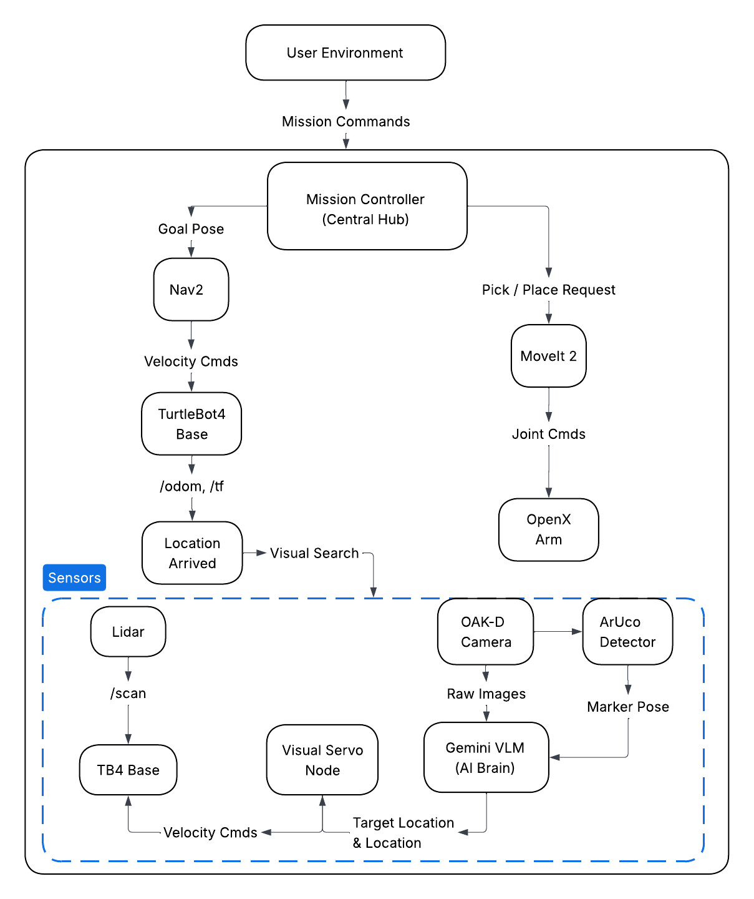

#  Autonomous Object Retrieval Project

Welcome to the official documentation for our autonomous warehouse retrieval system. This project bridges advanced mobile navigation, robotic manipulation, and Vision-Language Models (VLMs) to create a fully autonomous robotic worker.

---

## Robot background
The TurtleBot 4 is the next-generation ROS 2 educational and research robot. Built on the highly capable iRobot Create 3 mobile base, it is equipped with an array of sensors including an RPLidar and an OAK-D PRO spatial AI camera. It provides a robust, out-of-the-box platform for developing advanced SLAM, navigation, and computer vision applications.

## Project Details: VLM-Driven Warehouse Retrieval
Our project elevates the standard TurtleBot 4 by integrating it with an OpenManipulator-X robotic arm and the Google Gemini Vision-Language Model (VLM). 

We have engineered an autonomous pipeline for object retrieval within a simulated warehouse environment. The system operates in the following sequence:

1. **Intelligence & Dispatch:** The Gemini VLM analyzes the environment or user request to identify which specific object needs to be retrieved. 
2. **Transit:** The robot utilizes the Nav2 stack to autonomously navigate to the designated warehouse zone.
3. **Perception & Grasping:** Upon arrival, the robot scans the area for the target item. Using a custom visual servoing pipeline, it aligns itself and uses the OpenManipulator-X arm to pick up the object.
4. **Return & Drop-off:** The robot calculates a path back to its "Home" base and safely deposits the retrieved item.

---

## Project Demonstration

Watch the fully integrated system execute a retrieval mission:

<div style="text-align: center;">
  <iframe src="https://drive.google.com/file/d/1isiiOjH_H5B2IAAsM0pp6g-UGzWQRGE0/preview" width="640" height="480" allow="autoplay" allowfullscreen></iframe>
</div>
<br>
---

## System Architecture




---

## System Requirements

This pipeline relies on the following core hardware and software components:

* **TurtleBot 4 Base (iRobot Create 3):** Provides the mobile chassis, odometry, and low-level motor control.
* **RPLidar:** A 2D laser scanner used for generating occupancy grids, localization (AMCL), and real-time obstacle avoidance.
* **OAK-D Pro Camera:** Provides RGB and Depth streams for the perception pipeline and VLM integration.
* **OpenManipulator-X Arm:** A 4-DOF robotic arm used for precision picking and placing.
* **ROS 2 & MoveIt 2:** The underlying middleware and motion planning frameworks managing the entire ecosystem.

---

## Quick Start Guide

### 1. Install Dependencies
Ensure your workspace is fully built and sourced before launching any nodes:
```bash
cd ~/workspace
rosdep install --from-paths src -y --ignore-src
colcon build
source install/setup.bash
```

### 2. Run Robot in Simulation
Ensure your workspace is fully built and sourced before launching any nodes:
```bash
Terminal 1: 
ros2 launch tb4_openx_sim gazebo_sim.launch.py

*** Wait for all controllers to load

Terminal 2: 
ros2 launch tb4_openx_navigation navigate.launch.py

*** Estimate the Location of the Robot using 2D Pose

Terminal 3: 
ros2 launch tb4_openx_manipulation move_group.launch.py

Terminal 4: 
ros2 launch tb4_openx_manipulation manipulation_pipeline.launch.py

Terminal 5: 
ros2 run tb4_openx_navigation mission_controller.py


```

### 1. Install Dependencies
Ensure your workspace is fully built and sourced before launching any nodes:
```bash

Terminal 1: 
ros2 launch turtlebot4_bringup standard.launch.py

*** Ensure the you saved your Map correct and all the ros2 topic from 
TB4 is publishing on our PC

Terminal 2: 
ros2 launch tb4_openx_navigation real_navigate.launch.py

*** Make sure Map is loaded and everthing is loaded 

Terminal 3: 
ros2 launch tb4_openx_manipulation move_group.launch.py use_sim:=false

Terminal 4: 
ros2 launch tb4_openx_manipulation real_manipulation_pipeline.launch.py

Terminal 5: 
ros2 run tb4_openx_navigation real_mission_controller.py

```