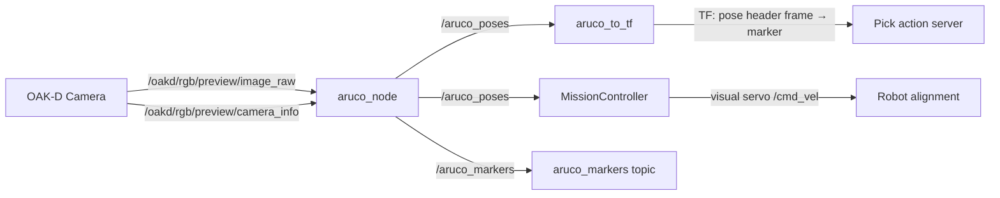

# Perception Architecture

The perception system provides the navigation and manipulation pipelines with the location and orientation of the target object. It publishes two outputs that the rest of the system depends on:

1. **`/aruco_poses`** (`geometry_msgs/PoseArray`) — consumed by the `MissionController` during the search and alignment phases.
2. **`marker` TF frame** — consumed by the `Pick` action server to plan the arm grasp.

The current mission flow uses the classical **ArUco** pipeline for both navigation alignment and arm handoff. A separate **Gemini Robotics-ER** pipeline also exists in the codebase.

---

## 1. ArUco Detection (Classical Pipeline)

ArUco markers are square fiducial patterns from the OpenCV library. Each marker encodes a unique binary ID inside a black border. The detector finds the four corners in the image, then uses the known physical size and camera intrinsics to solve the Perspective-n-Point (PnP) problem — recovering the full 6-DoF pose of the marker relative to the camera.


### Detection Pipeline
The `aruco_node` runs on every incoming camera frame:
1. Convert image to grayscale (`mono8`).
2. `cv2.aruco.detectMarkers()` — adaptive thresholding, square detection, bit extraction, dictionary lookup. Returns corner pixel coordinates and marker IDs.
3. `cv2.aruco.estimatePoseSingleMarkers()` — solves PnP using the four corner positions, known marker size, and camera intrinsics. Returns rotation vectors (`rvecs`) and translation vectors (`tvecs`).
4. `cv2.Rodrigues()` — converts the rotation vector into a 3x3 rotation matrix.
5. `tf_transformations.quaternion_from_matrix()` — converts the rotation matrix into a quaternion.
6. Publishes the result as a `PoseArray` on `/aruco_poses` and as `ArucoMarkers` on `/aruco_markers`.

### TF Bridge: `aruco_to_tf`
The `aruco_node` only publishes poses on a topic. The manipulation pipelines need a **TF frame**. A separate bridge node (`aruco_to_tf` in `tb4_openx_manipulation`) subscribes to `/aruco_poses`, takes the first pose, and broadcasts it as:
parent: pose header frame → child: marker
This is what creates the `marker` frame in the TF tree. In the current workflow, the `aruco_to_tf` bridge is launched by `tb4_openx_manipulation/manipulation_pipeline.launch.py`, which creates the `marker` TF frame used downstream.


### Perception Outputs
The ArUco perception pipeline exposes two outputs for downstream subsystems:

1. `/aruco_poses` (`geometry_msgs/PoseArray`)
2. `marker` TF frame

These outputs are consumed later by the navigation and manipulation modules.

### Coordinate Frame Convention
* **X** — right in the image
* **Y** — down in the image
* **Z** — forward (depth into the scene)

The marker's Z-axis points **out of the tag face** (toward the camera when the robot is facing it).

### Data Flow


### Configuration
* **Dictionary:** `DICT_5X5_250`
* **Image topic:** `/oakd/rgb/preview/image_raw`
* **Camera info topic:** `/oakd/rgb/preview/camera_info`

### Dependencies
**ROS 2:** `rclpy`, `sensor_msgs`, `geometry_msgs`, `cv_bridge`, `tf2_ros`, `ros2_aruco_interfaces`

**Python:** `opencv-python`, `numpy`, `tf_transformations`

### Launching
The ArUco node is launched as part of the manipulation pipeline:
```bash
ros2 launch tb4_openx_manipulation manipulation_pipeline.launch.py
