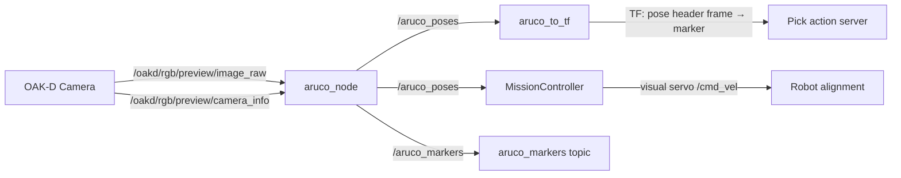
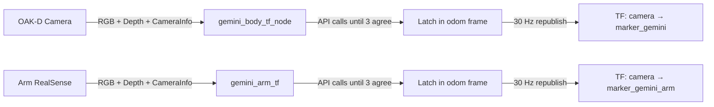

# Perception Architecture

The perception system provides the navigation and manipulation pipelines with the location and orientation of the target object. It publishes two outputs that the rest of the system depends on:

1. **`/aruco_poses`** (`geometry_msgs/PoseArray`) — consumed by the `MissionController` during the search and alignment phases.
2. **`marker` TF frame** consumed by the `Pick` action server to plan the arm grasp.

The current mission flow uses the **ArUco** pipeline for both navigation alignment and arm manupulation. A separate **VLM based Gemini Robotics-ER** pipeline also exists in the codebase.

---

## 1. ArUco Detection (Classical Pipeline)

ArUco markers are square fiducial patterns from the OpenCV library. Each marker encodes a unique binary ID inside a black border. The detector finds the four corners in the image, then uses the known physical size and camera intrinsics to solve the Perspective-n-Point (PnP) problem recovering the full 6-DoF pose of the marker relative to the camera.


### Detection Pipeline
The `aruco_node` runs on every incoming camera frame:
1. Convert image to grayscale (`mono8`).
2. `cv2.aruco.detectMarkers()` — adaptive thresholding, square detection, bit extraction, dictionary lookup. Returns corner pixel coordinates and marker IDs.
3. `cv2.aruco.estimatePoseSingleMarkers()` — solves PnP using the four corner positions, known marker size, and camera intrinsics. Returns rotation vectors (`rvecs`) and translation vectors (`tvecs`).
4. `cv2.Rodrigues()` — converts the rotation vector into a 3x3 rotation matrix.
5. `tf_transformations.quaternion_from_matrix()` — converts the rotation matrix into a quaternion.
6. Publishes the result as a `PoseArray` on `/aruco_poses` and as `ArucoMarkers` on `/aruco_markers`.

### TF Bridge: `aruco_to_tf`
The `aruco_node` only publishes poses on a topic. The manipulation pipelines need a **TF frame**. A separate bridge node (`aruco_to_tf` in `tb4_openx_manipulation`) subscribes to `/aruco_poses`, takes the first pose, and broadcasts it as:
parent: pose header frame → child: marker
This is what creates the `marker` frame in the TF tree. In the current workflow, the `aruco_to_tf` bridge is launched by `tb4_openx_manipulation/manipulation_pipeline.launch.py`, which creates the `marker` TF frame used downstream.


### Perception Outputs
The ArUco perception pipeline exposes two outputs for downstream subsystems:

1. `/aruco_poses` (`geometry_msgs/PoseArray`)
2. `marker` TF frame

These outputs are consumed later by the navigation and manipulation modules.

### Coordinate Frame Convention
* **X** — right in the image
* **Y** — down in the image
* **Z** — forward (depth into the scene)

The marker's Z-axis points **out of the tag face** (toward the camera when the robot is facing it).

### Data Flow


### Configuration
* **Dictionary:** `DICT_5X5_250`
* **Image topic:** `/oakd/rgb/preview/image_raw`
* **Camera info topic:** `/oakd/rgb/preview/camera_info`

### Dependencies
**ROS 2:** `rclpy`, `sensor_msgs`, `geometry_msgs`, `cv_bridge`, `tf2_ros`, `ros2_aruco_interfaces`

**Python:** `opencv-python`, `numpy`, `tf_transformations`

### Launching
The ArUco node is launched as part of the manipulation pipeline:
```bash
ros2 launch tb4_openx_manipulation manipulation_pipeline.launch.py
    MC -->|visual servo /cmd_vel| NAV[Robot alignment]
```
## 2. Gemini Robotics-ER (AI Pipeline)

Gemini Robotics-ER is a vision-language model from Google that can locate objects in images by text description alone. We use the `gemini-robotics-er-1.6-preview` model to detect and localize arbitrary objects in the camera frame.

### Why a VLM?
ArUco requires a physical fiducial marker on every targetn on the other hand gemini can detect **any object by description** the user needs to just change a text parameter:
```bash
ros2 launch ros2_gemini_er gemini_debug.launch.py target_label:="red cube"
ros2 launch ros2_gemini_er gemini_debug.launch.py target_label:="trash bag"
ros2 launch ros2_gemini_er gemini_debug.launch.py target_label:="bottle"
```

### The API Rate-Limit Problem
The free-tier Gemini Robotics-ER API is capped at **5 requests per minute** and **20 requests per day**. Continuous detection like ArUco (30 Hz) is impossible.

### Architecture: One-Shot Latch + Chain Republish

Instead of calling the API continuously, we:

1. **Detect** — call Gemini with the current camera image + text prompt. The API returns normalized pixel coordinates `[y, x]` (0–1000 range) of the detected object.
2. **Back-project to 3D** — use the depth image and camera intrinsics (pinhole model: `z = depth[v,u]`, `x = (u-cx)*z/fx`, `y = (v-cy)*z/fy`) to convert the 2D pixel into a 3D point in the camera frame.
3. **Estimate orientation** — fit a plane to the depth patch around the detection using SVD (surface normal → Z-axis), then run Canny edge detection + PCA on the RGB patch for in-plane rotation recovery (dominant edge → X-axis).
4. **Repeat until consensus** — perform multiple API detections until **3 consecutive detections agree** (within 10cm in the anchor frame).
5. **Latch in odom frame** — once consensus is reached, compose the `camera→target` transform with `odom→camera` (from the TF tree) to get `odom→target`. Cache this. The target is static in the world, so this pose doesn't change.
6. **Republish at 30 Hz** — a timer reconstructs `camera→target` every 33ms by computing `inv(odom→camera_now) * odom→target_cached`. This gives a continuously updating TF as the robot moves, without any further API calls.

### Robustness
* **Multi-detection consensus:** Requires **3 consecutive agreeing detections** (within 10cm in odom frame) before committing the latch.
* **MAD outlier rejection:** When fitting the depth plane for orientation, pixels that deviate more than 2.5x the median absolute deviation from the median depth are rejected. This prevents background contamination when the target is small.
* **Circuit breaker:** If the odom/map frame is unreachable for 5 consecutive attempts (e.g., localization not running), the node stops calling the API entirely to protect the daily quota.

### What It Publishes
The Gemini pipeline currently publishes **TF frames only** — it does not publish to `/aruco_poses`:

| Node | TF Frame Published | 
|------|-------------------|
| `gemini_body_tf` | `marker_gemini` | 
| `gemini_arm_tf` | `marker_gemini_arm` |


These are **separate frames** from ArUco's `marker` frame, so both pipelines can run in parallel without interfering with each other.

### Data Flow



### Configuration

| Parameter | Default | Description |
|-----------|---------|-------------|
| `target_label` | `artag` | Text prompt — what to detect |
| `model_name` | `gemini-robotics-er-1.6-preview` | Gemini model |
| `confidence_threshold` | `0.4` | Minimum confidence to accept a detection |
| `publish_rate_limit_hz` | `0.025` | API call rate per node (0.025 Hz = 1 call per 40s) |
| `latch_in_map` | `true` | Cache pose in anchor frame after consensus |
| `map_frame` | `odom` | Anchor frame (`odom` for sim-only, `map` with Nav2) |
| `republish_rate_hz` | `30.0` | Rate of cached TF republish |
| `min_consecutive_detections` | `3` | Agreeing detections before latch commits |
| `latch_position_tolerance_m` | `0.10` | Max spread between candidates |
| `max_failed_latch_attempts` | `5` | Circuit breaker threshold |

### Dependencies
**ROS 2:** `rclpy`, `sensor_msgs`, `geometry_msgs`, `std_msgs`, `tf2_ros`, `cv_bridge`, `message_filters`

**Python:** `google-genai`, `opencv-python`, `numpy`

**External:** Google Gemini API key (free tier: 5 RPM / 20 RPD)

### Launching
```bash
export GOOGLE_API_KEY="your-key"
ros2 launch ros2_gemini_er gemini_debug.launch.py
# With Nav2 running:
ros2 launch ros2_gemini_er gemini_debug.launch.py map_frame:=map
```

### Re-detect (resets latch)
```bash
ros2 topic pub --once /gemini/redetect std_msgs/msg/Empty
ros2 topic pub --once /gemini/redetect_arm std_msgs/msg/Empty
```


---

## 3. Integration Status and Tradeoffs

The Gemini pipeline currently runs **in parallel** with ArUco. It publishes its own TF frames (`marker_gemini`, `marker_gemini_arm`) alongside ArUco's `marker` frame. The navigation and manipulation code still uses ArUco exclusively the Gemini output is available for comparison and validation but is not wired into the mission controller.

To make Gemini a drop-in replacement for ArUco, two things would need to happen:
1. Rename the TF output from `marker_gemini` to `marker`.
2. Add an adapter node that converts the TF into `/aruco_poses` PoseArray messages.

We tested by spawning a red cube at `(2.0, 0.0, 0.3)` in Gazebo and Gemini returned `(1.92, 0.0, 0.286)` — roughly **8cm error in x** and **1.4cm in z**, which is reasonable given the object was far from the camera.

| | ArUco | Gemini Robotics-ER |
|---|---|---|
| **Detection range** | Short (< 2-3m, needs visible marker) | Long (any recognizable object) |
| **Accuracy** | Sub-centimeter at close range | ~1-10cm depending on distance |
| **Requires marker** | Yes | No (text prompt only) |
| **API cost** | None | ~3 calls to latch (free tier: 20/day) |
| **Orientation** | Precise (PnP from 4 corners) | Estimated (depth plane fit + edge PCA) |
| **Update rate** | 30 Hz native | 30 Hz via latch + chain republish |

**For the navigation visual servoing** (lateral centering, skew correction, 30cm approach), ArUco's sub-centimeter precision is currently more reliable. The alignment tolerances (`3cm` lateral, `2.5cm` distance, `10°` skew) demand accuracy that the VLM cannot yet consistently deliver at range.

**For the pick-and-place task**, the arm needs even more precise localization, which the current VLM accuracy cannot guarantee.

Where Gemini performs good is in the search phase it can detect and localize an object from across the room in a single API call, potentially eliminating the need to navigate to specific zones and spin-search entirely. A hybrid approach (Gemini for long-range discovery, ArUco for close-range precision) is a natural next step.


